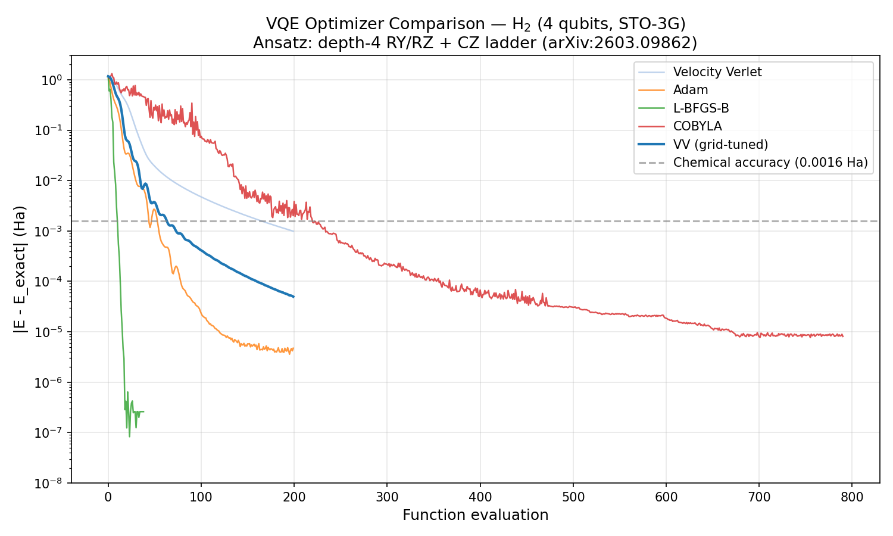

# Velocity Verlet VQE Optimizer — Reproducing arXiv:2603.09862

Thí nghiệm tái hiện kết quả paper **"Velocity Verlet-Based Optimization for Variational Quantum Eigensolvers"** (Rinka Miura, March 2026) trên qforge engine.

Paper đề xuất dùng **velocity Verlet integrator** từ molecular dynamics làm optimizer cho VQE, thay vì các optimizer cổ điển như Adam hay L-BFGS-B.

## Ý tưởng chính

Thay vì coi VQE parameters `theta` là bài toán tối ưu tĩnh, paper coi chúng như **vị trí của hạt** trong hệ động lực học có ma sát:

```
F(theta) = -grad E(theta)                    # gradient năng lượng → lực

v(t + dt/2) = v(t) + dt * F(t) / (2m)        # half-step velocity
theta(t + dt) = theta(t) + dt * v(t + dt/2)  # cập nhật vị trí (tham số)
v(t + dt) = v(t + dt/2) + dt * F(t+dt) / (2m)# full-step velocity
v(t + dt) *= (1 - gamma)                     # damping (ma sát)
```

Nhờ momentum, optimizer có thể vượt qua local minima nông tốt hơn gradient descent thuần.

## Setup thí nghiệm

### Bài toán: Ground state H2

- **Phân tử**: H2, bond length 0.74 angstrom
- **Basis set**: STO-3G (minimal basis)
- **Qubit mapping**: Jordan-Wigner → 4 qubits
- **Hamiltonian**: Pre-computed trong `qforge.chem.Molecule`, chỉ chứa electronic energy (không có nuclear repulsion)
- **Exact ground-state energy**: -1.83043 Ha (electronic), -1.11533 Ha (total = electronic + nuclear repulsion 0.715 Ha)

### Ansatz: Hardware-efficient depth-4

Mạch lượng tử parametrized theo paper:

```
Layer 0:  RY(q0,θ0) RZ(q0,θ1) | RY(q1,θ2) RZ(q1,θ3) | ... → CZ(0,1) CZ(1,2) CZ(2,3)
Layer 1:  RY(q0,θ8) RZ(q0,θ9) | RY(q1,θ10) RZ(q1,θ11)| ... → CZ(0,1) CZ(1,2) CZ(2,3)
...
Layer 4:  RY(q0,θ32) RZ(q0,θ33) | ... (không có CZ trailing)
```

- Mỗi layer: **RY + RZ** rotation trên từng qubit, rồi **CZ ladder** nối nearest-neighbor
- Layer cuối chỉ có rotation, không có CZ
- Tổng tham số: `n_qubits * (n_layers + 1) * 2 = 4 * 5 * 2 = 40`
- CZ được implement bằng `CPhase(control, target, pi)` trong qforge

### Các optimizer so sánh

| Optimizer | Loại | Cách dùng gradient |
|-----------|------|-------------------|
| **Velocity Verlet** | Momentum-based | Parameter-shift rule (qforge) |
| **Adam** | Adaptive learning rate | Parameter-shift rule (qforge) |
| **L-BFGS-B** | Quasi-Newton | Parameter-shift rule → `jac=True` cho scipy |
| **COBYLA** | Gradient-free | Không dùng gradient |

### Chemical accuracy

Ngưỡng `1.6 x 10^-3 Hartree` (~1 kcal/mol) — sai số đủ nhỏ để dự đoán chính xác tính chất hóa học.

## Giải thích tham số

### Velocity Verlet

| Tham số | Ý nghĩa | Giá trị tốt (grid search) |
|---------|---------|--------------------------|
| `dt` | Bước thời gian — lớn hơn → di chuyển xa hơn mỗi step, nhưng dễ dao động | 0.30 |
| `mass` | Khối lượng hiệu dụng — lớn hơn → quán tính lớn, khó đổi hướng | 1.0 |
| `gamma` | Hệ số ma sát [0, 1) — lớn hơn → dampen dao động nhanh hơn, nhưng giảm khả năng thoát local minima | 0.20 |

**Quan hệ giữa các tham số:**
- `dt` lớn + `gamma` nhỏ → dao động mạnh, có thể không hội tụ
- `dt` nhỏ + `gamma` lớn → hội tụ chậm, gần giống gradient descent
- `dt` vừa + `gamma` vừa → cân bằng giữa exploration và convergence

### Thí nghiệm

| Tham số | Giá trị | Lý do |
|---------|---------|-------|
| `MAX_STEPS` | 200 | Đủ cho VV và Adam hội tụ |
| `GRID_STEPS` | 100 | Coarse sweep nhanh, re-run best với 200 |
| `SEED` | 42 | Reproducibility — tất cả optimizer dùng cùng initial params |
| `INIT_PARAMS` | Uniform(-pi, pi) | Random initialization tiêu chuẩn cho VQE |

### Grid search

Sweep qua 18 cấu hình (3 dt x 3 gamma x 2 mass) với 100 steps mỗi config, chọn config có error nhỏ nhất, rồi re-run với 200 steps.

## Chạy thí nghiệm

```bash
# Từ thư mục gốc qforge
pip install -e .
python samples/verlet_vqe/verlet_vqe_h2.py
```

Thời gian chạy: ~15-20 phút (Phase 1: ~2 phút, Grid search: ~12 phút, Phase 3: ~1 phút).

Output:
- Console: bảng so sánh các optimizer
- `verlet_vqe_convergence.png`: convergence plot

## Kết quả

| Optimizer | Error (Ha) | Chemical accuracy @ step | Evals |
|-----------|-----------|-------------------------|-------|
| L-BFGS-B (analytical grad) | 2.60e-7 | 10 | 39 |
| Adam (lr=0.05) | 4.72e-6 | 44 | 200 |
| VV grid-tuned (dt=0.3, gamma=0.2) | 4.98e-5 | 63 | 200 |
| VV default (dt=0.2, gamma=0.2) | 9.90e-4 | 164 | 200 |
| COBYLA | 8.09e-6 | 220 | 791 |

### Convergence plot



### So sánh với paper

| Claim | Paper | Qforge | Khớp? |
|-------|-------|--------|-------|
| VV đạt chemical accuracy | Yes | Yes (step 63) | OK |
| VV tốt hơn COBYLA | Yes | Yes (63 vs 220) | OK |
| VV tốt hơn L-BFGS-B | Yes | Không — L-BFGS-B + analytical grad rất mạnh | Khác |

**Lý do khác biệt L-BFGS-B**: Paper có thể dùng L-BFGS-B với finite-difference gradient (mặc định của scipy), kém chính xác với quantum circuits. Khi cung cấp analytical gradient qua parameter-shift rule, L-BFGS-B hội tụ cực nhanh (quasi-Newton + exact gradient).

## Cấu trúc file

```
samples/verlet_vqe/
├── README.md                       # File này
├── verlet_vqe_h2.py               # Script thí nghiệm chính
└── verlet_vqe_convergence.png     # Convergence plot (generated)
```
